# Auto-remediation on TicketMonster

This repo builds upon the [monolith-to-microservices on OpenShift](https://github.com/dynatrace-innovationlab/monolith-to-microservice-openshift/) repository which uses TicketMonster as its sample application.


**Remediation**

The remediation scenario is as follows: Assuming we have a healthy build in production (tm-ui-v2, backend-v2, orders-service) we are switching the *feature flag* to route new traffic to the new orders-service. In our demo, the orders service will slow down the booking process. Rolling back the service won't solve the issue, instead we have to turn of the feature flag. This will be automatically done by the *remediaton action* link in the deployment description for enabling the feature flag. Please note that enabling the feature flag has to be done via a deployment to let Dyntrace know of this action.


## Prepare our services

1. Add auto-tagging rule to our services: on our tenant go to `Settings -> Tags -> Automatically applied tags`.
    
1. Add new rule for "Service" for services:

    Optional tag value:
    ```
    {ProcessGroup:KubernetesNamespace}-{ProcessGroup:KubernetesContainerName}-{Service:WebServiceName}
    ```
    where `Kubernetes namespace` exists.

1. Add a new alerting profile
    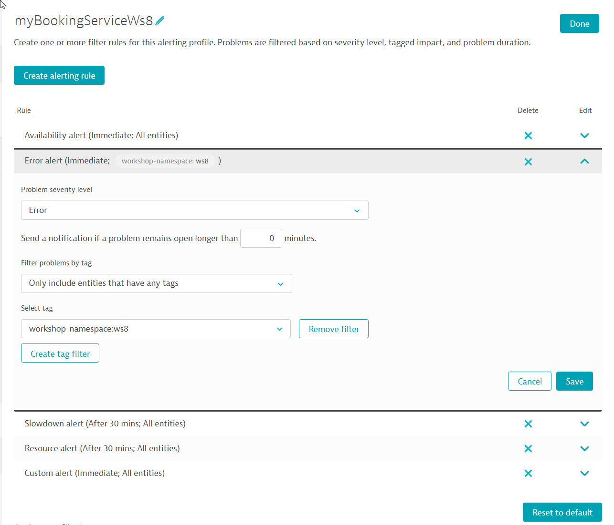

1. Adjust the anomaly detection settings for the service under suspicion. 
    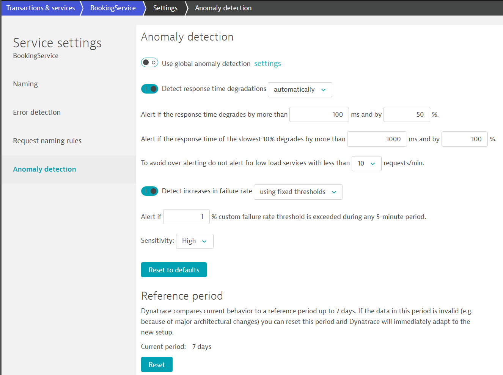


## Define remediaton actions as playbook

In ```playbook.yaml``` all remediation action should be defined. This will be the file that comprises all tasks that can be used for remediation.

## Optional: Execute remediation actions locally

Test the remediation actions locally with Ansible installed.
```
$ ansible-playbook playbook.yml
```

## Set up Ansible Tower as the automation platform

Set up Ansible Tower with the `ansible-cloudformation.json` file on AWS infrastructure.

1. Login with your AWS account to the AWS console
1. Create an S3 bucket that will hold the files needed in this example. Name could be for example: `YOURNAME-workshop`
1. Upload to files to your S3 bucket.
    - Your Ansible Tower license - naming **has to be**: `ansible-license.txt`
    - Your playbook - naming **has to be**: `playbook.yaml`
    - Your remediation playbook - name **has to be**: `remediation.yaml`
1. Set permission of all files to **public** (they will be automatically downloaded later by the script)
1. Navigate to CloudFormation
1. Choose template and "upload to S3"
1. Fill out the template: 

    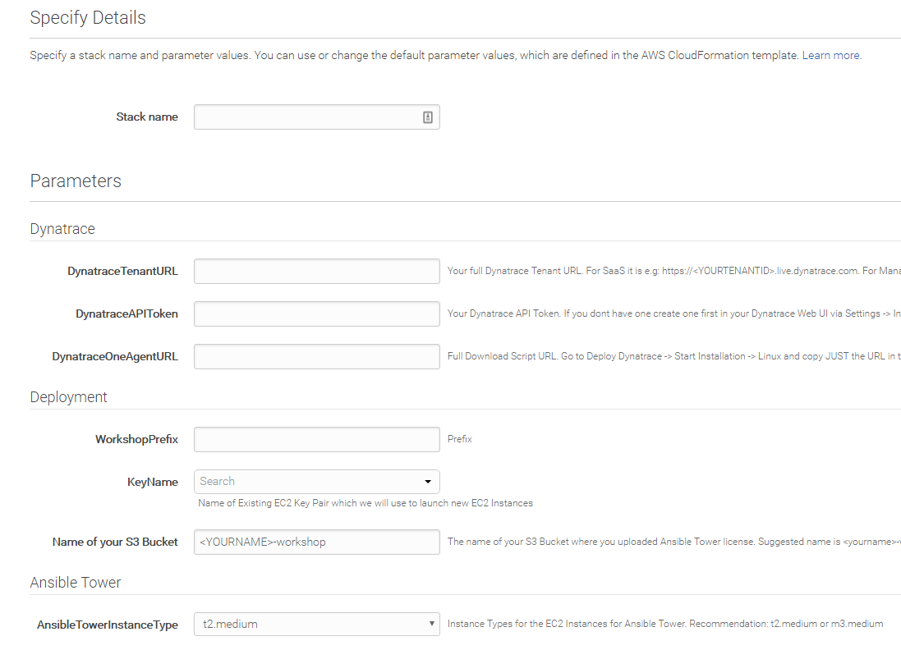

1. Create! (and wait a couple of minutes for it to finish)

### Check your Ansible Tower installation

1. Check your outputs of the Cloudformation template:

    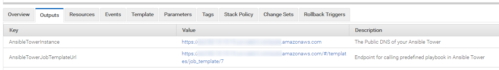

1. Navigate to your Ansible Tower instance
1. Login with the demo credentials: admin / dynatrace
1. Verify the setup:

    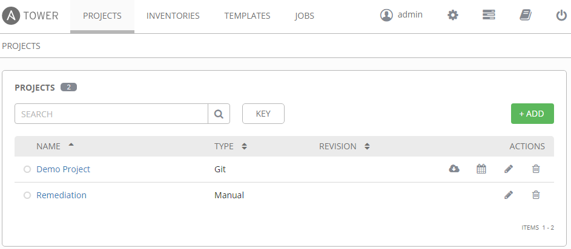
    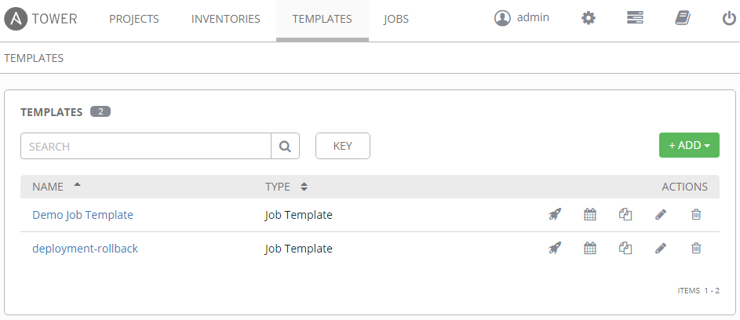

    You should find something similar. (a project, a job template)

## Create inventory in Ansible Tower

Make sure to replace the placeholders with your own project specific values:
- YOUR-TENANT-ID
- YOUR-API-TOKEN
- XX ... your workshop project number
- PROJECT.YOURURL ... eg., ws-21.127.0.0.1.xip.io

Please double check the value of `remedationaction`: number 9 should be the default value, please check if in your environment it is set to 9 or any other value and adjust this accordingly.

```
---
tenantid: YOUR-TENTANT-ID
apitoken: YOUR-API-TOKEN
commentuser: "Ansible Playbook"
bookingservice_tag: "wsXX-backend-v*-BookingService"
dtcommentapiurl: "https://{{tenantid}}.live.dynatrace.com/api/v1/problem/details/{{pid}}/comments?Api-Token={{apitoken}}"
dtdeploymentapiurl: "https://{{tenantid}}.live.dynatrace.com/api/v1/events/?Api-Token={{apitoken}}"
remediationaction: "https://tower-url/api/v2/job_templates/9/launch/"
featuretoggleurl_internal_enable: "http://backend-v2-PROJECT.YOURURL/ff4j-console?op=enable&uid=orders-internal"
featuretoggleurl_internal_disable: "http://backend-v2-PROJECT.YOURURL/ff4j-console?op=disable&uid=orders-internal"
featuretoggleurl_microservice_enable: "http://backend-v2-PROJECT.YOURURL/ff4j-console?op=enable&uid=orders-service"
featuretoggleurl_microservice_disable: "http://backend-v2-PROJECT.YOURURL/ff4j-console?op=disable&uid=orders-service"
```


## Set up problem notification for Ansible Tower

Basically, there are two options. One is to used the convenient logo integration Dynatrace provides for Ansible Tower. The other option is to use a custom integration. Both options are detailed in the next steps:

### Option 1 (preferred): Use Ansible Tower integration

1. Setup notification

    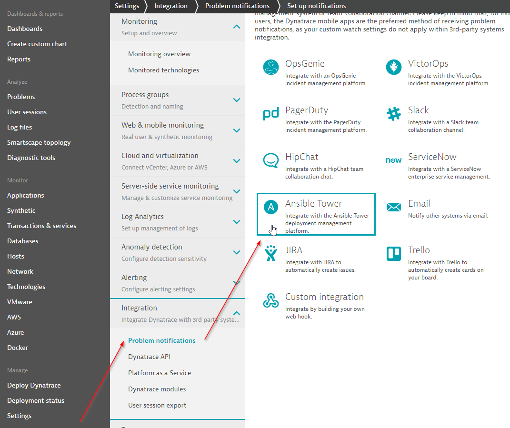


1. Insert credentials and job template url (copy template url from the CloudFormation template outputs)

    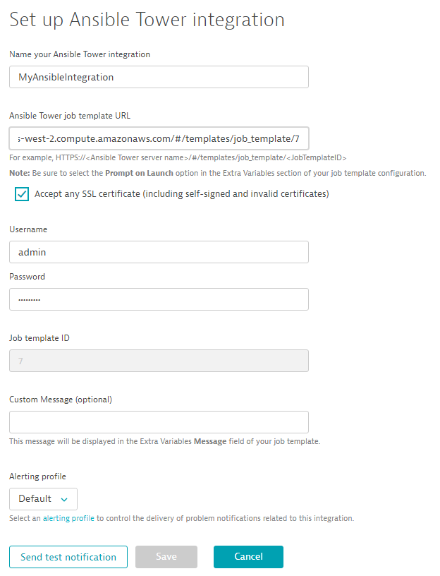

1. If needed, use an alerting profile.

1. Send test notification and save the integration.

### Option 2: Use custom integration
<details><summary>If you choose to do a custom integration instead of the integration suggested in Option 1, click here.</summary>
Setup a problem notification in your Dynatrace tenant:

1. Setup notification

    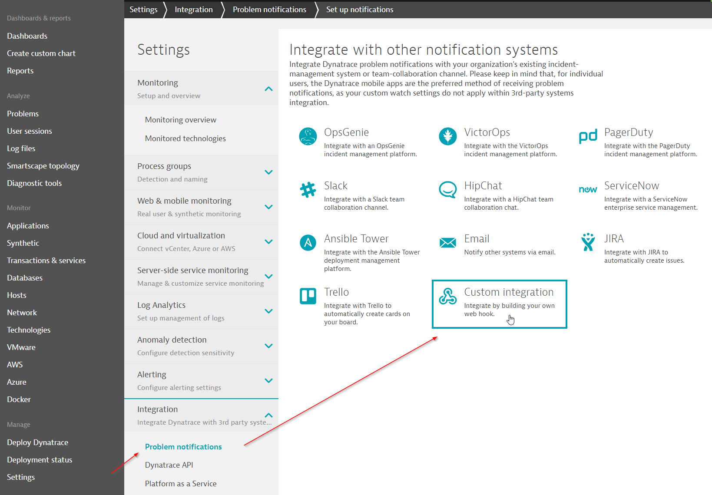


1. Insert the API URL for the job template - *with* the trailing slash.
    ```
    https://YOUR-TOWER/api/v2/job_templates/YOUR-JOB-ID/launch/
 
    ```

1. Custom payload
    ```
    { "extra_vars": {
        "state":"{State}",
        "problemID":"{ProblemID}",
        "problemTitle":"{ProblemTitle}",
        "pid":"{pid}",
        "impactedEntity":"{ImpactedEntity}",
        "impactedEntities":{ImpactedEntities}
        }
    }
    ```

1.  If needed, set the alerting profile to your own service/namespace.

1. Send test notification and save integration.
</details>

## Auto-remediation workflow

1. Make sure the feature flags are set to the correct starting position for this demo, i.e., they are set to the internal orderservice only.

    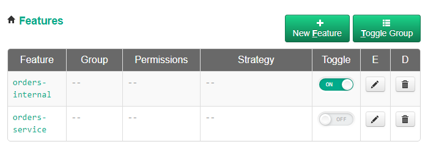


1. Start the load generator script that creates a booking every second by making a HTTP post request to the booking service endpoint.

    ```
    ./generate-bookings.sh
    ```

1. In your Ansible Tower, run the `enable microservice` job template.
    
    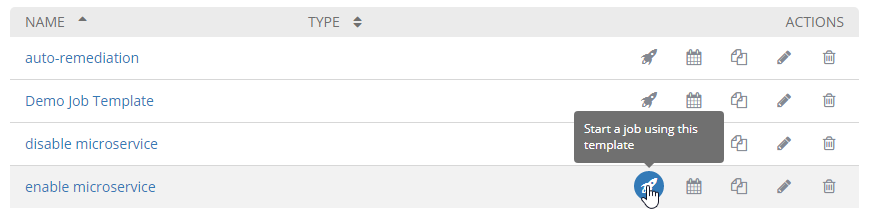

1. Wait for Dynatrace to detect the problem.

1. Dynatrace will send a notification to Ansible Tower which will then start the remediation by switching the feature flags. (This should be quite fast)

1. After a couple of minutes the problem is resolved. (This takes a while for Dynatrace to close the problem)

<!--
### See auto-remediation in action

watch and see
-->
