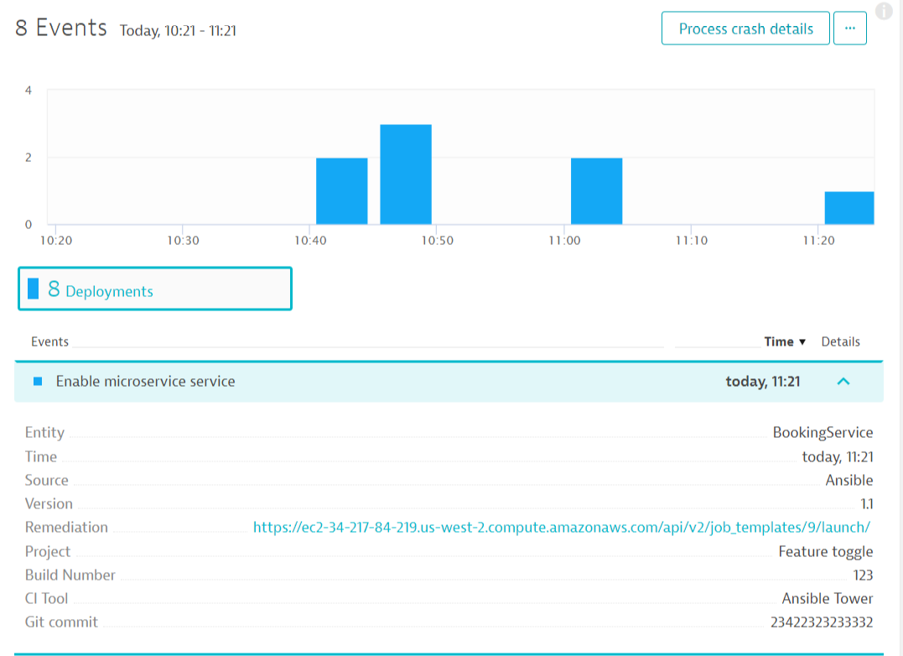

# Auto-remediation on TicketMonster

This repo builds upon the [monolith-to-microservices on OpenShift](https://github.com/dynatrace-innovationlab/monolith-to-microservice-openshift/) repository which uses TicketMonster as its sample application.


**Remediation**

The remediation scenario is as follows: Assuming we have a healthy build in production (tm-ui-v2, backend-v2, orders-service) we are switching the *feature flag* to route new traffic to the new orders-service. In our demo, the orders service will slow down the booking process. Rolling back the service won't solve the issue, instead we have to turn of the feature flag. This will be automatically done by the *remediaton action* link in the deployment description for enabling the feature flag. Please note that enabling the feature flag has to be done via a deployment to let Dyntrace know of this action.


## Prerequisites

Get your free Ansible Tower license here: [Ansible license](https://www.ansible.com/license) with limited features up to 10 nodes is sufficient.

## Prepare our services

1. Add auto-tagging rule to our services: on our tenant go to `Settings -> Tags -> Automatically applied tags`.
    
1. Add new rule for "Service" for services:

    Optional tag value:
    ```
    {ProcessGroup:KubernetesNamespace}-{ProcessGroup:KubernetesContainerName}-{Service:WebServiceName}
    ```
    where `Kubernetes namespace` exists.

1. Add a new alerting profile
    

1. Adjust the anomaly detection settings for the service under suspicion. 
    


## Define remediaton actions as playbook

In ```playbook.yaml``` all remediation action should be defined. This will be the file that comprises all tasks that can be used for remediation.

## Optional: Execute remediation actions locally

Test the remediation actions locally with Ansible installed.
```
$ ansible-playbook playbook.yml
```

## Set up Ansible Tower as the automation platform

Set up Ansible Tower with the `ansible-cloudformation.json` file on AWS infrastructure.

1. Login with your AWS account to the AWS console
1. Create an S3 bucket that will hold the files needed in this example. Name could be for example: `YOURNAME-workshop`
1. Upload to files to your S3 bucket.
    - Your Ansible Tower license - naming **has to be**: `ansible-license.txt`
    - Your playbook - naming **has to be**: `playbook.yaml`
    - Your remediation playbook - name **has to be**: `remediation.yaml`
1. Set permission of all files to **public** (they will be automatically downloaded later by the script)
1. Navigate to CloudFormation
1. Choose template and "upload to S3"
1. Fill out the template: 

    

1. Create! (and wait a couple of minutes for it to finish)

### Check your Ansible Tower installation

1. Check your outputs of the Cloudformation template:

    

1. Navigate to your Ansible Tower instance by clicking on the link (might take a couple of minutes to show up correctly in your browser - please be patient!)
    _Why does it take so long?_ Because there a several things going on: installing the OneAgente on this host, setting the correct login information for Ansible Tower, downloading all scripts for the remedation for this lab, ...
1. Login with the demo credentials: admin / dynatrace
1. Verify the setup:

    
    

    You should find something similar. (a project, a job template)

## Create inventory in Ansible Tower

1. Navigate to "Inventories" and edit the "Demo Inventory".
1. Copy the following snippet to the "variables" section:
    ```
    ---
    tenantid: "xxx"
    apitoken: "xxx"
    towerurl: "https://yoururl.compute.amazonaws.com"
    backendurl: "http://backend-v2-wsXX.xxx.xip.io"
    commentuser: "Ansible Playbook"
    bookingservice_tag: "wsXX-backend-v*-BookingService"
    dtcommentapiurl: "https://{{tenantid}}.live.dynatrace.com/api/v1/problem/details/{{pid}}/comments?Api-Token={{apitoken}}"
    dtdeploymentapiurl: "https://{{tenantid}}.live.dynatrace.com/api/v1/events/?Api-Token={{apitoken}}"
    remediationaction: "{{towerurl}}/api/v2/job_templates/9/launch/"
    featuretoggleurl_internal_enable: "{{backendurl}}/ff4j-console?op=enable&uid=orders-internal"
    featuretoggleurl_internal_disable: "{{backendurl}}/ff4j-console?op=disable&uid=orders-internal"
    featuretoggleurl_microservice_enable: "{{backendurl}}/ff4j-console?op=enable&uid=orders-service"
    featuretoggleurl_microservice_disable: "{{backendurl}}/ff4j-console?op=disable&uid=orders-service"
    ```


    Make sure to replace the placeholders with your own project specific values:
    - tenantid
    - apitoken
    - towerurl
    - backendurl
    - bookingservice_tag
    - remediationaction

    Please double check the value of `remedationaction`: number 9 should be the default value, please check if in your environment it is set to 9 or any other value and adjust this accordingly.
1. Save


## Create job templates for the playbooks
### Job template for "Enable orders microservice"
1. Navigate to "Templates" and click "+Add" -> "Job Template"
1. Name it "Enable orders microservice"
1. Select the demo inventory by clicking on the magnifier next to "Inventory"
1. Select the "remediation" project
1. For the playbook, select the "playbook.yaml" --> if you don't see the playbook.yaml here, make sure your S3 bucket is set to public, delete the cloudformation stack and create it again.
1. Select the demo credentials (they are not needed but credentials have to be defined)
1. For "job tags" insert: `featuretoggle-enable-microservice` and make sure to hit enter to have it inserted as a tag
1. Check the "prompt on launch" checkbox for "Extra variables"
1. Save

### Job template for "Disable orders microservice"
1. Copy the job template "Enable orders microservice"
1. Rename the job template to "Disable orders microservice"
1. Remove the tag `featuretoggle-enable-microservice` from the job tags
1. Insert the tag `featuretoggle-disable-microservice` to the job tags  


## Set up problem notification for Ansible Tower

Basically, there are two options. One is to used the convenient logo integration Dynatrace provides for Ansible Tower. The other option is to use a custom integration. Both options are detailed in the next steps:

### Option 1 (preferred): Use Ansible Tower integration

1. Setup notification

    


1. Insert credentials and job template url (copy template url from the CloudFormation template outputs)

    

1. If needed, use an alerting profile.

1. Send test notification and save the integration.

### Option 2: Use custom integration
<details><summary>If you choose to do a custom integration instead of the integration suggested in Option 1, click here.</summary>
Setup a problem notification in your Dynatrace tenant:

1. Setup notification

    


1. Insert the API URL for the job template - *with* the trailing slash.
    ```
    https://YOUR-TOWER/api/v2/job_templates/YOUR-JOB-ID/launch/
 
    ```

1. Custom payload
    ```
    { "extra_vars": {
        "state":"{State}",
        "problemID":"{ProblemID}",
        "problemTitle":"{ProblemTitle}",
        "pid":"{pid}",
        "impactedEntity":"{ImpactedEntity}",
        "impactedEntities":{ImpactedEntities}
        }
    }
    ```

1.  If needed, set the alerting profile to your own service/namespace.

1. Send test notification and save integration.
</details>

## Auto-remediation workflow

1. Make sure the feature flags are set to the correct starting position for this demo, i.e., they are set to the internal orderservice only. If not, just execute the `disable microservice` job in your Ansible Tower or manually switch the toggles to the correct starting position.

    


1. Start the load generator script that creates a booking every second by making a HTTP post request to the booking service endpoint. Make sure to adjust the script to *call YOUR API endpoint*! (Therefore, edit the URL in the script `generate-bookings.sh`)

    ```
    ./generate-bookings.sh
    ```

1. In your Ansible Tower, run the `enable microservice` job template.
    
    

1. Wait for Dynatrace to detect the problem.

1. Dynatrace will send a notification to Ansible Tower which will then start the remediation by switching the feature flags. (This should be quite fast)

1. After a couple of minutes the problem is resolved. (This takes a while for Dynatrace to close the problem)

## What happens behind the scenes in this demo
- When firing the `enable microservice` job in Ansible Tower, it will run all tasks tagged with `featuretoogle-enable-microservice` in the `playbook.yaml` file. This switches the feature toggle for internal to `false` and the one for the microservice to `true`. It also sends a deployment event to Dynatrace so you see there was a change.
 
- When hitting the service with some load, Dynatrace will detect that the service is not behaving correclty due to an increased failure rate.
- That causes Dynatrace to fire a problem and will send a problem notification to the configured Ansible Tower.
- Ansible Tower will start the `remediation.yaml` playbook, which essentially does the following:
    - Pushing a comment to the Dynatrace problem that the playbook was started and a remediation workflow now kicks in.
    - Fetching all custom deployment events assigned to the entities of this problem.
    - Getting the most recent deployment event and looking for a remediation action.
    - Calling this remediation action - in our case it's switching back the feature toggle to route traffic to the internal booking method.
    - Pushing a comment to Dynatrace if the action was executed succesfully or not.
- The problem should now be remediated.
- Dynatrace will close the problem after a couple of minutes.


<!--
### See auto-remediation in action

watch and see
-->

# Troubleshooting
- Ansible Tower: if you can't login to Ansible Tower make sure you have set our S3 bucket to public. Then delete the Cloudformation template and start again.
- If you have the `generate-bookings.sh` running for a long time, periodically check in your Ticket Monster application in the "Monitor" section if there are still tickets available (the default venue only allows 2000 tickets). You can always delete all bookings to make sure new bookings won't fail.
